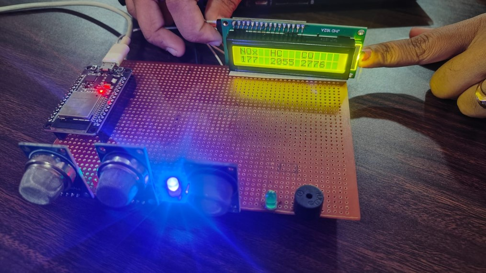

# Smart Emission Control System for Vehicles

## Overview
The **Smart Emission Control System** is a project aimed at reducing vehicular emissions by monitoring and controlling the release of harmful gases such as CO, NOx, and hydrocarbons (HC). By utilizing modern IoT technology, this system provides real-time monitoring and alerts to help ensure compliance with environmental standards and promote eco-friendly driving habits.

## Features
- **Real-Time Monitoring**: The system employs sensors to detect CO, NOx, and HC levels, displaying the data on an LCD screen for immediate feedback.
- **IoT Integration**: Remote monitoring and data analysis are enabled through the Blynk app, allowing users to manage emissions from their smartphones.
- **Alert System**: Visual and auditory alerts (LEDs and a buzzer) are triggered when gas levels exceed safe thresholds, ensuring immediate action can be taken.
- **Environmental Impact**: By reducing harmful emissions, this system contributes to better air quality and environmental sustainability.

## Components
- **ESP32 Microcontroller**: The heart of the system, managing data processing and communication.
- **Gas Sensors**: MQ-135, MQ-2, and MQ-7 sensors are used to detect different types of gases.
- **LCD Display**: Provides real-time data visualization.
- **LEDs and Buzzer**: Serve as alert mechanisms when gas levels are high.
- **Blynk App**: Enables remote monitoring and control through a smartphone interface.

## How It Works
1. **Gas Detection**: The sensors continuously monitor the exhaust gases for CO, NOx, and HC levels.
2. **Data Processing**: The ESP32 microcontroller processes the sensor data and determines if the levels are within acceptable ranges.
3. **Alerts**: If the emission levels exceed the predefined thresholds, the system activates LEDs and a buzzer to alert the user.
4. **Remote Monitoring**: Data is transmitted to the cloud and can be accessed via the Blynk app for remote monitoring.

## System Architecture
The system is designed with the following architecture:
- **ESP32 Microcontroller**: Interfaces with sensors and handles data processing.
- **Sensors**: MQ-135 (air quality), MQ-2 (flammable gases), and MQ-7 (carbon monoxide).
- **Display**: 16x2 LCD screen for displaying real-time gas levels.
- **Connectivity**: WiFi module for sending data to the cloud.
- **Power Supply**: Ensures continuous operation of all components.

## Installation and Setup

### Hardware Setup
- Connect the sensors to the ESP32 microcontroller.
- Set up the LCD display for real-time monitoring.
- Integrate LEDs and a buzzer for the alert system.
- Ensure the power supply is stable and adequate for all components.

### Software Setup
- Install the Arduino IDE and the necessary libraries for ESP32 and sensors.
- Upload the provided code to the ESP32 microcontroller.
- Configure the Blynk app with the correct authentication tokens for remote monitoring.

### Final Implimenetation

### Configuration
- Set the gas concentration thresholds within the code according to local environmental standards.
- Test the system by simulating different emission levels to ensure proper functionality.

